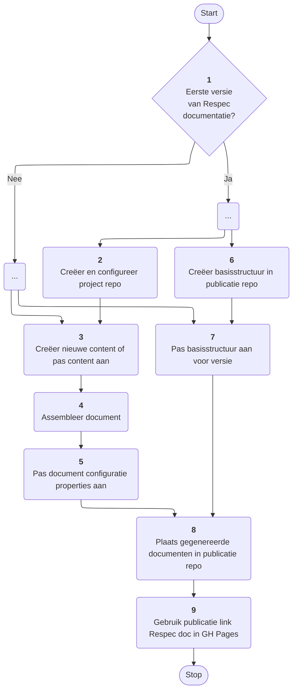
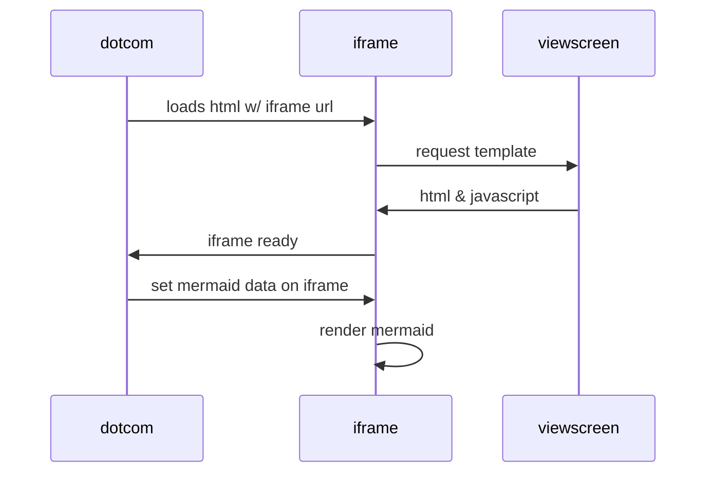
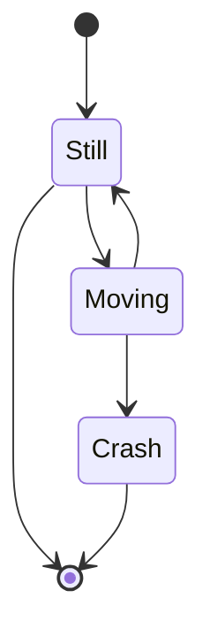
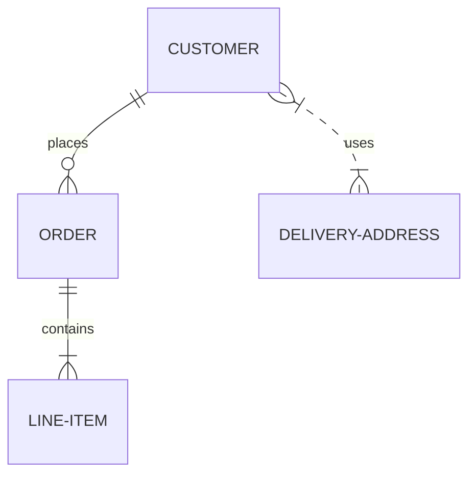
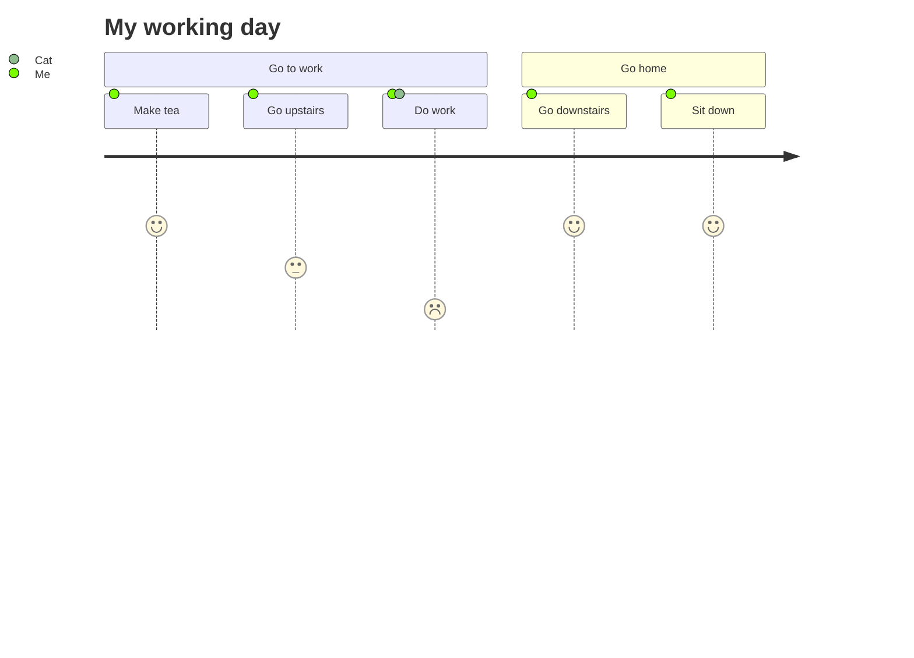
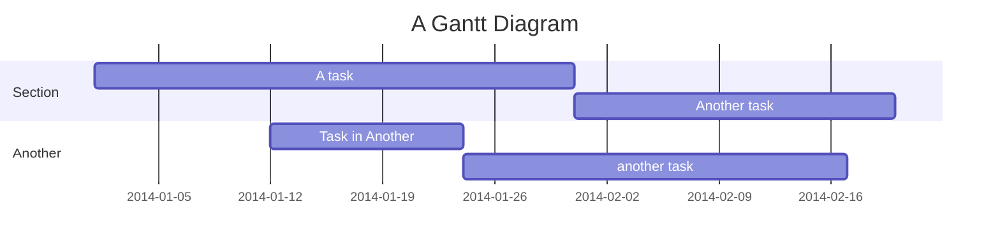
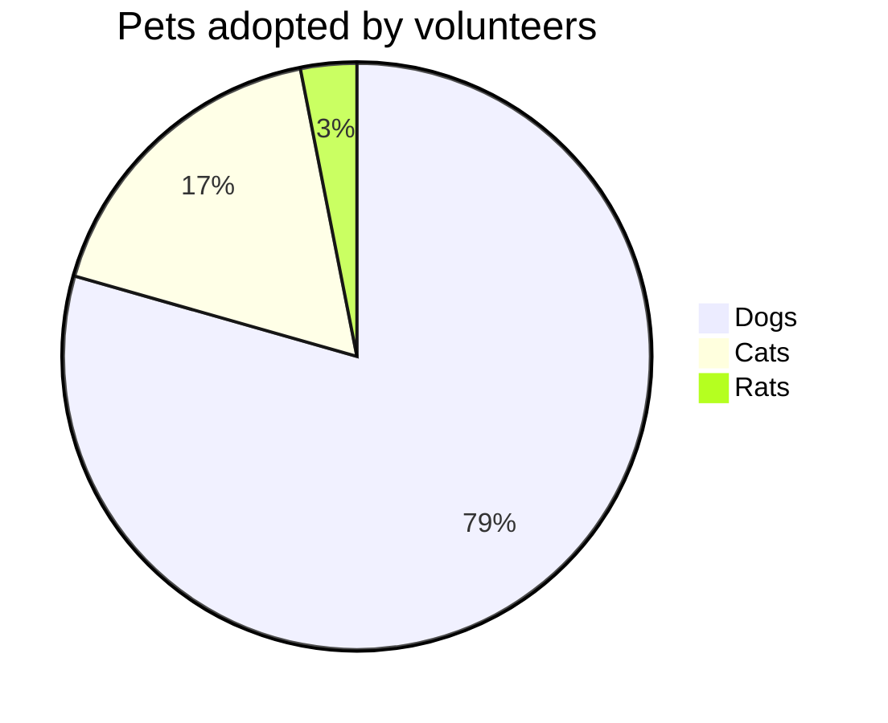

# Het VNG-R Respec proces

Onderstaande flowchart beschrijft het proces zoals we dat binnen VNG Realisatie hanteren om tot Respec documentatie te komen. Daarnaast is het echter ook een voorbeeld van het gebruik van de Mermaid syntax voor het vervaardigen van zo'n flowchart. 

<figure>
    


<figcaption>Het VNG-R Respec proces (Mermaid voorbeeld)</figcaption>
</figure><br/><br/>

Zie de '[GitHub documentatie](https://docs.github.com/en/get-started/writing-on-github/working-with-advanced-formatting/creating-diagrams#creating-mermaid-diagrams)' voor een uitleg van de Mermaid syntax.

**Aandachtspunten m.b.t. Mermaid**

* In de code van het  bovenstaand voorbeeld is de mermaid code binnen een `figure` element geplaatst'. Let daarbij op dat er voorafgaand aan de eerste en na de laatste ```` ``` ```` code een lege regel wordt geplaatst. Het `figure` element mag dus niet direct aansluiten op de ```` ``` ```` code.
* Vermijd markdown frontmatter secties zoals<br/><code>---</code><br/><code>title: Animal example</code><br/><code>---</code><br/>De ervaring is dat deze een goede verwerking van de Mermaid code verhinderd.

Hieronder nog een aantal Mermaid voorbeelden.

<figure>



<figcaption>Sequence diagram</figcaption>
</figure>

<figure>



<figcaption>state diagram</figcaption>
</figure>

<figure>



<figcaption>ER diagram</figcaption>
</figure>

<figure>



<figcaption>Journey diagram</figcaption>
</figure>

<figure>



<figcaption>Gantt chart</figcaption>
</figure>

<figure>



<figcaption>Pie charts</figcaption>
</figure>
